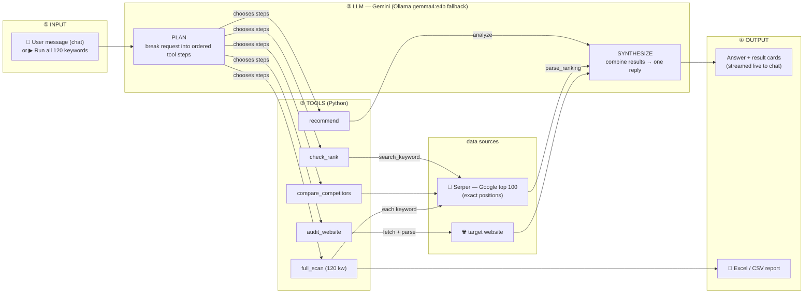
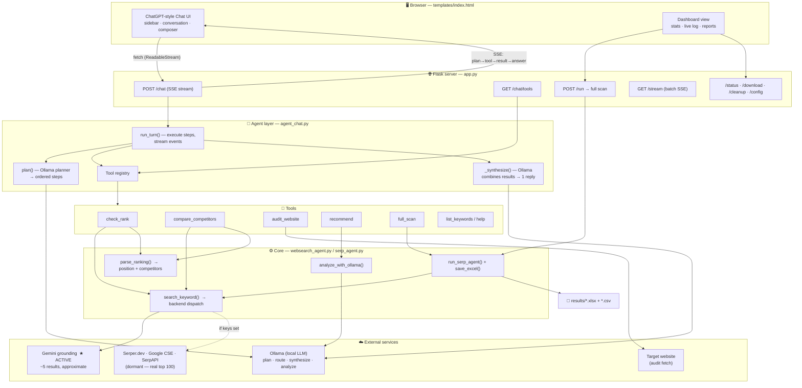
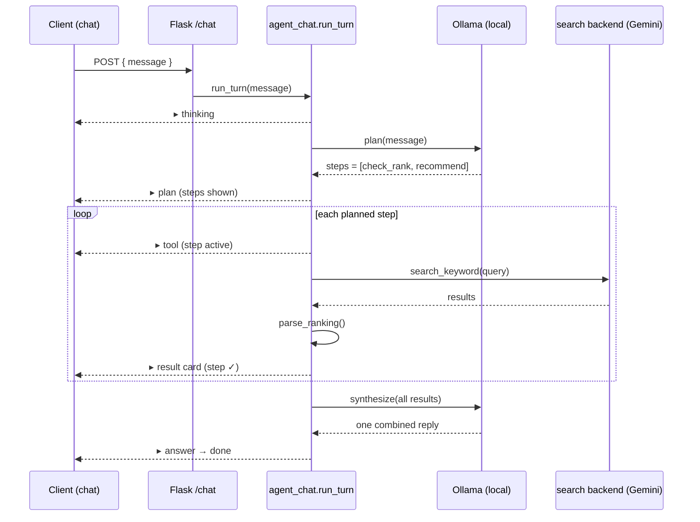

# SERP Agent — Architecture

Assured Home Nursing SERP tracker. A **chat-driven, agentic** SEO assistant: the client
types a request, **Gemini plans** the steps, Python **executes** the tools, and the agent
**synthesizes** one answer — streamed live into a ChatGPT-style UI. The local Ollama model
(`gemma4:e4b`) is the **automatic fallback** for reasoning if Gemini is unavailable.

---

## Input → LLM → Tools → Output (flow)



**One line:** `user input → Gemini PLAN → run tools → Serper/website data → Gemini SYNTHESIZE → answer (chat) + Excel (scan)`

---

## High-level diagram (Mermaid)



---

## Agent turn — sequence (what happens on each chat message)



---

## Pipeline (one line)

```
Client message
   → Flask /chat (SSE)
   → Ollama PLAN  → ordered tool steps
   → execute tools  → Gemini grounding search + parse ranking / fetch site / analyze
   → Ollama SYNTHESIZE  → single answer
   → stream plan + steps + cards + answer back to the chat UI
```

---

## Components

| Layer | File | Responsibility |
|---|---|---|
| UI | `templates/index.html` | ChatGPT-style chat (sidebar, conversation, composer) + Dashboard; consumes the `/chat` SSE stream |
| Server | `app.py` | Routes; streams agent events; launches the full-scan batch; serves reports |
| Agent | `agent_chat.py` | Planner, router, `run_turn()` executor, answer synthesis (skills loaded via `skills/`) |
| Skills | `skills/<name>/` | One folder per capability — `SKILL.md` (card + metadata) + `skill.py` (`run`/`render`). See [AGENTS.md](AGENTS.md) |
| Core | `websearch_agent.py` | `search_keyword()` backend dispatch, `parse_ranking()`, `analyze_with_ollama()`, search providers |
| Batch | `serp_agent.py` | 120-keyword catalog, `run_serp_agent()`, `save_excel()` |
| Brain (primary) | **Gemini** (JSON mode) | Plans steps, routes intent, synthesizes replies, SEO analysis |
| Brain (fallback) | Ollama `gemma4:e4b` (local) | Used automatically only if Gemini is unavailable/quota-limited |
| Search | Gemini grounding (active) | Returns the sources Google cited (~5, approximate). Serper/CSE/SerpAPI are built but dormant until their key is added |

Set via `REASONING_BACKEND` (default `gemini`) and `SEARCH_BACKEND` (default `gemini`) in `config.json`.

## Search backends (pluggable via `SEARCH_BACKEND`)

| Backend | Results | Positions | Cost | Status |
|---|---|---|---|---|
| `gemini` | ~5–30 | approximate | free (Gemini key) | ★ **active** |
| `serper` | up to 100 | exact | free 2,500/mo | ready (needs key) |
| `google_cse` | up to 100 | exact | free 100/day | ready (needs key + cx) |
| `serpapi` | up to 100 | exact | free 100/mo | ready (needs key) |
| `ollama` | 10 | approximate | free | available |

Adding a backend's key to `config.json` auto-switches the agent to it on next start
(Serper preferred, then Google CSE), otherwise it stays on Gemini grounding.
